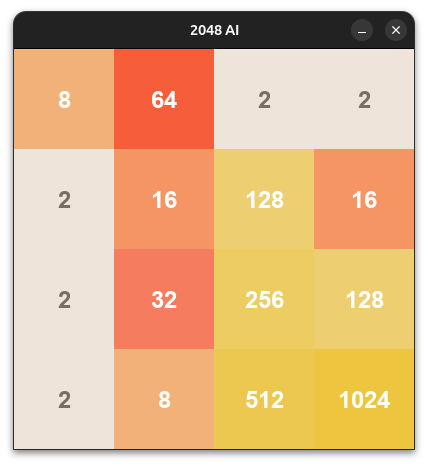
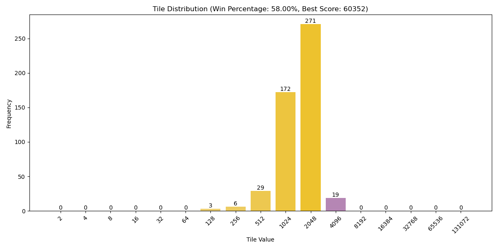

# 2048 AI

This repository contains a collection of AI agents designed to play the game 2048 using various strategies, including Monte Carlo methods and reinforcement learning techniques. The project is intended to serve as an open-source resource for those interested in studying and developing AI for complex decision-making problems.

<p align="center">
  
</p>

## Table of Contents

- [Introduction](#introduction)
- [Installation](#installation)
- [Usage](#usage)
- [Agents](#agents)
  - [Monte Carlo Agent](#monte-carlo-agent)
  - [Advanced Monte Carlo Agent](#advanced-monte-carlo-agent)
  - [Enhanced Monte Carlo Agent](#enhanced-monte-carlo-agent)
  - [QLearning Agent](#qlearning-agent)
- [Contributing](#contributing)
- [License](#license)

## Introduction

2048 is a popular single-player sliding block puzzle game. The objective is to slide numbered tiles on a grid to combine them and create a tile with the number 2048. This project implements several AI agents that play the game, using different techniques to make decisions and optimize their gameplay.

## Installation

To get started with this project, clone the repository and install the required dependencies:

```bash
git clone https://github.com/AlexFigas/2048-ai.git
cd 2048-ai
pip install -r requirements.txt
```

## Usage

You can run any of the AI agents to see how they perform in playing 2048. Each agent has a main script that can be executed directly. For example, to run the AdvancedMonteCarloAgent:

```bash
python src/AdvancedMonteCarloAgent.py
```

## Example Output

As the AI agent plays the game, it will display the current state of the board and the chosen moves in the console and in a GUI (in the case of the `AdvancedMonteCarloAgent.py`).

```bash
Best move: up
Final board:
[[   4    2    0    0]
 [   8    4    2    0]
 [  32   16    8    4]
 [ 256  128   64   32]]
```

## Agents

### Monte Carlo Agent

The `MonteCarloAgent` uses a basic Monte Carlo simulation to evaluate potential moves. It performs a series of random simulations to estimate the best possible move based on the resulting scores.

- File: `src/MonteCarloAgent.py`
- Strategy: Random simulations

### Advanced Monte Carlo Agent

The `AdvancedMonteCarloAgent` builds upon the basic Monte Carlo approach by incorporating heuristics like board smoothness, monotonicity, and weighted tiles to guide its decision-making process.

- File: `src/AdvancedMonteCarloAgent.py`
- Strategy: Monte Carlo with heuristics

### Enhanced Monte Carlo Agent

The `EnhancedMonteCarloAgent` further enhances the Monte Carlo method with a simplified heuristic scoring system, balancing exploration and exploitation to find better moves.

- File: `src/EnhancedMonteCarloAgent.py`
- Strategy: Monte Carlo with simplified heuristics

### QLearning Agent

The `QLearningAgent` applies reinforcement learning, specifically Q-learning, to develop a strategy by learning from previous moves and their outcomes.

- File: `src/QLearningAgent.py`
- Strategy: Q-learning (Reinforcement Learning)

## Results

In the end I ran a 500 simulation testing session, took over 8 hours to complete but here are the results:




### Contributing

Contributions are welcome! If you'd like to contribute to this project, please follow these steps:

    - Fork the repository
    - Create a new branch (git checkout -b feature-branch)
    - Commit your changes (git commit -m 'Add new feature')
    - Push to the branch (git push origin feature-branch)
    - Open a Pull Request

## License

This project is licensed under the GNU General Public License v3.0 License - see the LICENSE file for details.


